# Database Schema — Dynamic Portfolio Platform

> **Target stack:** Node.js · Express · TypeScript · PostgreSQL · Prisma
> **Design date:** 2025-08-25

---

## Table of Contents

1. [Architecture & Design Decisions](#1-architecture--design-decisions)
2. [Enums](#2-enums)
3. [Table Reference](#3-table-reference)
4. [Entity Relationship Overview](#4-entity-relationship-overview)
5. [Full CREATE TABLE SQL](#5-full-create-table-sql)
6. [Index Summary](#6-index-summary)
7. [Ambiguities & Notes](#7-ambiguities--notes)

---

## 1. Architecture & Design Decisions

### 1.1 Core Principles

| Principle | Implementation |
|---|---|
| **Dynamic admin control** | Every public-facing entity has `is_enabled`, `sort_order`, and/or `status` columns so the admin can enable/disable/reorder without code changes. |
| **Content status lifecycle** | Content entities use a shared `content_status` enum: `draft → published → scheduled → archived → disabled`. |
| **Centralized media** | A single `media` table stores every uploaded file. All other tables reference it via foreign key — no duplicated file metadata. |
| **Markdown for long-form** | Blog body, project case studies, research content, and dynamic pages store Markdown/MDX in a `TEXT` column. Structured metadata (slug, dates, tags) lives in typed columns for querying. |
| **Content versioning** | A generic `content_versions` table stores JSON snapshots keyed by `(entity_type, entity_id, version)`. This avoids per-table version tables. |
| **Tagging & categories** | A reusable polymorphic tag system: `tags` + `entity_tags` junction. Categories are separate per-domain (project categories, blog categories) because their semantics differ. |
| **SEO metadata** | Inlined on every content entity (seo_title, seo_description, seo_keywords, og_image) rather than a separate table, because every page has exactly one SEO record and JOINs add cost for the most latency-sensitive queries. |
| **Visitor tracking** | Dedicated `visitors` (session-level) and `page_views` (hit-level) tables, plus a `link_clicks` table for outbound-click analytics. |
| **Dynamic pages** | A `pages` table powers arbitrary routes (`/now`, `/uses`, `/stack`, `/faq`, etc.) with Markdown content and full admin control. |
| **Homepage sections** | A `homepage_sections` table with `section_type`, `sort_order`, `is_enabled`, and optional `config` JSON for section-specific settings. |
| **Content blocks** | A `content_blocks` table for reusable page-builder-style blocks (text, markdown, image, stats, CTA, project list, blog list). |
| **Audit trail** | `created_at` / `updated_at` on every table. The `content_versions` table provides history for content entities. An `activity_log` table records admin actions. |

### 1.2 Naming Conventions

- **Tables:** `snake_case`, plural (e.g., `projects`, `blog_posts`).
- **Columns:** `snake_case`.
- **Primary keys:** `id UUID DEFAULT gen_random_uuid()`.
- **Timestamps:** `TIMESTAMPTZ` everywhere (timezone-aware).
- **Soft delete:** Not used globally. Content has `status = 'archived'/'disabled'` instead. Hard delete with audit log is preferred for simplicity.
- **Sort order:** `sort_order INTEGER DEFAULT 0` — lower = first.

### 1.3 Table Grouping

| Group | Tables |
|---|---|
| **Identity & Auth** | `authors`, `sessions` |
| **Profile & About** | `site_settings`, `about_sections`, `availability_status` (stored in `site_settings`) |
| **Skills** | `skill_categories`, `skills` |
| **Experience & Education** | `experiences`, `education` |
| **Certifications & Achievements** | `certificates`, `achievements` |
| **Projects** | `projects`, `project_categories`, `project_technologies` |
| **Writing** | `blog_posts`, `blog_categories`, `research_papers` |
| **Tags** | `tags`, `entity_tags` |
| **Media** | `media` |
| **Gallery** | `gallery_items` |
| **Resume** | `resumes` |
| **Social Links** | `social_links` |
| **Open Source** | `opensource_contributions` |
| **Timeline** | `timeline_events` |
| **Dynamic Pages** | `pages` |
| **Homepage** | `homepage_sections`, `content_blocks` |
| **Contact** | `contact_submissions`, `email_templates` |
| **Guestbook** | `guestbook_entries` |
| **Testimonials** | `testimonials` |
| **Navigation** | `nav_items` |
| **Newsletter** | `newsletter_subscribers` |
| **Analytics** | `visitors`, `page_views`, `link_clicks` |
| **Versioning & Audit** | `content_versions`, `activity_log` |

---

## 2. Enums

```sql
-- Content lifecycle status
CREATE TYPE content_status AS ENUM (
  'draft',
  'published',
  'scheduled',
  'archived',
  'disabled'
);

-- Media file types
CREATE TYPE media_type AS ENUM (
  'image',
  'video',
  'pdf',
  'document',
  'other'
);

-- Project type categories
CREATE TYPE project_type AS ENUM (
  'personal',
  'freelance',
  'academic',
  'professional',
  'open_source'
);

-- Project status
CREATE TYPE project_status AS ENUM (
  'in_progress',
  'completed',
  'on_hold',
  'abandoned'
);

-- Timeline event type
CREATE TYPE timeline_event_type AS ENUM (
  'education',
  'job',
  'project',
  'achievement',
  'milestone'
);

-- Guestbook entry moderation status
CREATE TYPE moderation_status AS ENUM (
  'pending',
  'approved',
  'rejected'
);

-- Contact submission read status
CREATE TYPE contact_status AS ENUM (
  'unread',
  'read',
  'replied',
  'archived'
);

-- Content block type for homepage/page builder
CREATE TYPE block_type AS ENUM (
  'text',
  'markdown',
  'image',
  'project_list',
  'blog_list',
  'stats',
  'cta'
);

-- Link click target types for analytics
CREATE TYPE click_target_type AS ENUM (
  'github',
  'live_demo',
  'resume_download',
  'social_link',
  'contact',
  'external'
);

-- Entity types for polymorphic relations (tags, versions)
CREATE TYPE entity_type AS ENUM (
  'blog_post',
  'project',
  'research_paper',
  'page',
  'achievement',
  'opensource_contribution'
);

-- Navigation item location
CREATE TYPE nav_location AS ENUM (
  'header',
  'footer',
  'both'
);
```

---

## 3. Table Reference

### 3.1 `authors`

The admin/owner and any additional authors. Supports multi-author content per the URL scheme (`/blogs/by/[author]`).

| Column | Type | Constraints | Notes |
|---|---|---|---|
| `id` | `UUID` | PK, DEFAULT `gen_random_uuid()` | |
| `username` | `VARCHAR(50)` | UNIQUE, NOT NULL | Used in URL slugs: `/blogs/by/{username}` |
| `display_name` | `VARCHAR(100)` | NOT NULL | |
| `email` | `VARCHAR(255)` | UNIQUE, NOT NULL | |
| `password_hash` | `VARCHAR(255)` | NOT NULL | Bcrypt/Argon2 hash |
| `bio` | `TEXT` | | Short author bio |
| `avatar_id` | `UUID` | FK → `media.id`, NULLABLE | |
| `is_admin` | `BOOLEAN` | DEFAULT `false` | |
| `is_enabled` | `BOOLEAN` | DEFAULT `true` | |
| `created_at` | `TIMESTAMPTZ` | DEFAULT `NOW()` | |
| `updated_at` | `TIMESTAMPTZ` | DEFAULT `NOW()` | |

---

### 3.2 `sessions`

JWT refresh token tracking for secure auth.

| Column | Type | Constraints | Notes |
|---|---|---|---|
| `id` | `UUID` | PK, DEFAULT `gen_random_uuid()` | |
| `author_id` | `UUID` | FK → `authors.id` ON DELETE CASCADE, NOT NULL | |
| `refresh_token_hash` | `VARCHAR(255)` | NOT NULL | Hashed refresh token |
| `user_agent` | `TEXT` | | Browser/device info |
| `ip_address` | `INET` | | |
| `expires_at` | `TIMESTAMPTZ` | NOT NULL | |
| `created_at` | `TIMESTAMPTZ` | DEFAULT `NOW()` | |

---

### 3.3 `site_settings`

Key-value store for global site configuration: site title, availability status, social defaults, theme preferences, and other admin-controlled settings.

| Column | Type | Constraints | Notes |
|---|---|---|---|
| `id` | `UUID` | PK, DEFAULT `gen_random_uuid()` | |
| `key` | `VARCHAR(100)` | UNIQUE, NOT NULL | e.g., `site_title`, `availability_status`, `default_seo_title` |
| `value` | `TEXT` | NOT NULL | Stored as text; app layer parses |
| `group` | `VARCHAR(50)` | DEFAULT `'general'` | For admin UI grouping: `general`, `seo`, `social`, `contact`, `theme` |
| `updated_at` | `TIMESTAMPTZ` | DEFAULT `NOW()` | |

**Reserved keys include:** `site_title`, `site_description`, `availability_status` (values: `available`, `freelance`, `unavailable`), `default_seo_title`, `default_seo_description`, `default_og_image_id`, `analytics_enabled`.

---

### 3.4 `media`

Centralized media library. Every image, PDF, resume file, and document is registered here once and referenced by FK from other tables.

| Column | Type | Constraints | Notes |
|---|---|---|---|
| `id` | `UUID` | PK, DEFAULT `gen_random_uuid()` | |
| `filename` | `VARCHAR(255)` | NOT NULL | Original filename |
| `url` | `TEXT` | NOT NULL | CDN/storage URL |
| `media_type` | `media_type` | NOT NULL | Enum: image, video, pdf, document, other |
| `mime_type` | `VARCHAR(100)` | NOT NULL | e.g., `image/png`, `application/pdf` |
| `size_bytes` | `INTEGER` | NOT NULL | File size |
| `width` | `INTEGER` | | For images/videos |
| `height` | `INTEGER` | | For images/videos |
| `alt_text` | `VARCHAR(500)` | | Accessibility text |
| `caption` | `TEXT` | | |
| `uploaded_by` | `UUID` | FK → `authors.id` ON DELETE SET NULL | |
| `created_at` | `TIMESTAMPTZ` | DEFAULT `NOW()` | Upload date |

---

### 3.5 `about_sections`

Dynamic sections for the `/about` page. Each section is a separate sub-page (`/about/[slug]`) with Markdown content and independent ordering/visibility.

| Column | Type | Constraints | Notes |
|---|---|---|---|
| `id` | `UUID` | PK, DEFAULT `gen_random_uuid()` | |
| `title` | `VARCHAR(200)` | NOT NULL | e.g., "About Anuj", "Skills", "Timeline" |
| `slug` | `VARCHAR(200)` | UNIQUE, NOT NULL | URL slug: `/about/{slug}` |
| `content` | `TEXT` | | Markdown/MDX body |
| `icon` | `VARCHAR(50)` | | Icon identifier for navigation |
| `sort_order` | `INTEGER` | DEFAULT `0` | |
| `is_enabled` | `BOOLEAN` | DEFAULT `true` | |
| `seo_title` | `VARCHAR(200)` | | |
| `seo_description` | `VARCHAR(500)` | | |
| `seo_keywords` | `VARCHAR(500)` | | Comma-separated |
| `og_image_id` | `UUID` | FK → `media.id` ON DELETE SET NULL | |
| `created_at` | `TIMESTAMPTZ` | DEFAULT `NOW()` | |
| `updated_at` | `TIMESTAMPTZ` | DEFAULT `NOW()` | |

---

### 3.6 `skill_categories`

Grouping for skills: Frontend, Backend, Cloud, Databases, Tools, etc.

| Column | Type | Constraints | Notes |
|---|---|---|---|
| `id` | `UUID` | PK, DEFAULT `gen_random_uuid()` | |
| `name` | `VARCHAR(100)` | UNIQUE, NOT NULL | |
| `slug` | `VARCHAR(100)` | UNIQUE, NOT NULL | |
| `description` | `TEXT` | | |
| `icon` | `VARCHAR(50)` | | |
| `sort_order` | `INTEGER` | DEFAULT `0` | |
| `is_enabled` | `BOOLEAN` | DEFAULT `true` | |
| `created_at` | `TIMESTAMPTZ` | DEFAULT `NOW()` | |
| `updated_at` | `TIMESTAMPTZ` | DEFAULT `NOW()` | |

---

### 3.7 `skills`

Individual skills belonging to a category.

| Column | Type | Constraints | Notes |
|---|---|---|---|
| `id` | `UUID` | PK, DEFAULT `gen_random_uuid()` | |
| `category_id` | `UUID` | FK → `skill_categories.id` ON DELETE CASCADE, NOT NULL | |
| `name` | `VARCHAR(100)` | NOT NULL | |
| `slug` | `VARCHAR(100)` | NOT NULL | |
| `icon` | `VARCHAR(50)` | | Icon class or URL |
| `proficiency` | `SMALLINT` | CHECK (0–100), NULLABLE | Optional skill level; nullable per spec |
| `sort_order` | `INTEGER` | DEFAULT `0` | |
| `is_enabled` | `BOOLEAN` | DEFAULT `true` | |
| `created_at` | `TIMESTAMPTZ` | DEFAULT `NOW()` | |
| `updated_at` | `TIMESTAMPTZ` | DEFAULT `NOW()` | |

**Unique constraint:** `(category_id, slug)`.

---

### 3.8 `experiences`

Professional work experience entries.

| Column | Type | Constraints | Notes |
|---|---|---|---|
| `id` | `UUID` | PK, DEFAULT `gen_random_uuid()` | |
| `company_name` | `VARCHAR(200)` | NOT NULL | |
| `role` | `VARCHAR(200)` | NOT NULL | |
| `location` | `VARCHAR(200)` | | |
| `start_date` | `DATE` | NOT NULL | |
| `end_date` | `DATE` | | NULL = current role |
| `is_current` | `BOOLEAN` | DEFAULT `false` | |
| `description` | `TEXT` | | Responsibilities & achievements (Markdown) |
| `technologies` | `TEXT[]` | | PostgreSQL text array of tech names |
| `company_logo_id` | `UUID` | FK → `media.id` ON DELETE SET NULL | |
| `company_url` | `TEXT` | | External company link |
| `sort_order` | `INTEGER` | DEFAULT `0` | |
| `is_enabled` | `BOOLEAN` | DEFAULT `true` | |
| `created_at` | `TIMESTAMPTZ` | DEFAULT `NOW()` | |
| `updated_at` | `TIMESTAMPTZ` | DEFAULT `NOW()` | |

---

### 3.9 `education`

Education entries.

| Column | Type | Constraints | Notes |
|---|---|---|---|
| `id` | `UUID` | PK, DEFAULT `gen_random_uuid()` | |
| `institution` | `VARCHAR(200)` | NOT NULL | |
| `degree` | `VARCHAR(200)` | NOT NULL | |
| `field_of_study` | `VARCHAR(200)` | | |
| `location` | `VARCHAR(200)` | | |
| `start_date` | `DATE` | NOT NULL | |
| `end_date` | `DATE` | | NULL = current |
| `is_current` | `BOOLEAN` | DEFAULT `false` | |
| `grade` | `VARCHAR(50)` | | GPA, percentage, etc. |
| `description` | `TEXT` | | Achievements, coursework (Markdown) |
| `activities` | `TEXT` | | Extracurriculars |
| `institution_logo_id` | `UUID` | FK → `media.id` ON DELETE SET NULL | |
| `sort_order` | `INTEGER` | DEFAULT `0` | |
| `is_enabled` | `BOOLEAN` | DEFAULT `true` | |
| `created_at` | `TIMESTAMPTZ` | DEFAULT `NOW()` | |
| `updated_at` | `TIMESTAMPTZ` | DEFAULT `NOW()` | |

---

### 3.10 `certificates`

Professional certifications and credentials.

| Column | Type | Constraints | Notes |
|---|---|---|---|
| `id` | `UUID` | PK, DEFAULT `gen_random_uuid()` | |
| `name` | `VARCHAR(200)` | NOT NULL | |
| `issuing_organization` | `VARCHAR(200)` | NOT NULL | |
| `issue_date` | `DATE` | NOT NULL | |
| `expiry_date` | `DATE` | | |
| `credential_id` | `VARCHAR(200)` | | |
| `credential_url` | `TEXT` | | Verification link |
| `certificate_image_id` | `UUID` | FK → `media.id` ON DELETE SET NULL | Image or PDF |
| `sort_order` | `INTEGER` | DEFAULT `0` | |
| `is_enabled` | `BOOLEAN` | DEFAULT `true` | |
| `created_at` | `TIMESTAMPTZ` | DEFAULT `NOW()` | |
| `updated_at` | `TIMESTAMPTZ` | DEFAULT `NOW()` | |

---

### 3.11 `achievements`

Awards, hackathons, competitions, scholarships, and recognitions.

| Column | Type | Constraints | Notes |
|---|---|---|---|
| `id` | `UUID` | PK, DEFAULT `gen_random_uuid()` | |
| `title` | `VARCHAR(200)` | NOT NULL | |
| `description` | `TEXT` | | |
| `date` | `DATE` | | |
| `issuer` | `VARCHAR(200)` | | Organizing body |
| `url` | `TEXT` | | External link |
| `image_id` | `UUID` | FK → `media.id` ON DELETE SET NULL | |
| `is_featured` | `BOOLEAN` | DEFAULT `false` | |
| `sort_order` | `INTEGER` | DEFAULT `0` | |
| `is_enabled` | `BOOLEAN` | DEFAULT `true` | |
| `created_at` | `TIMESTAMPTZ` | DEFAULT `NOW()` | |
| `updated_at` | `TIMESTAMPTZ` | DEFAULT `NOW()` | |

---

### 3.12 `project_categories`

Categories for filtering projects (e.g., Web App, Mobile App, Library, CLI Tool).

| Column | Type | Constraints | Notes |
|---|---|---|---|
| `id` | `UUID` | PK, DEFAULT `gen_random_uuid()` | |
| `name` | `VARCHAR(100)` | UNIQUE, NOT NULL | |
| `slug` | `VARCHAR(100)` | UNIQUE, NOT NULL | |
| `description` | `TEXT` | | |
| `sort_order` | `INTEGER` | DEFAULT `0` | |
| `is_enabled` | `BOOLEAN` | DEFAULT `true` | |
| `created_at` | `TIMESTAMPTZ` | DEFAULT `NOW()` | |
| `updated_at` | `TIMESTAMPTZ` | DEFAULT `NOW()` | |

---

### 3.13 `projects`

Core project records. Routes: `/works`, `/works/by/[author]/[slug]`.

| Column | Type | Constraints | Notes |
|---|---|---|---|
| `id` | `UUID` | PK, DEFAULT `gen_random_uuid()` | |
| `author_id` | `UUID` | FK → `authors.id` ON DELETE RESTRICT, NOT NULL | |
| `category_id` | `UUID` | FK → `project_categories.id` ON DELETE SET NULL | |
| `title` | `VARCHAR(300)` | NOT NULL | |
| `slug` | `VARCHAR(300)` | NOT NULL | |
| `short_description` | `TEXT` | NOT NULL | Card/listing summary |
| `content` | `TEXT` | | Full case study in Markdown/MDX |
| `cover_image_id` | `UUID` | FK → `media.id` ON DELETE SET NULL | |
| `technologies` | `TEXT[]` | | PostgreSQL text array |
| `github_url` | `TEXT` | | |
| `live_url` | `TEXT` | | Demo link |
| `project_type` | `project_type` | DEFAULT `'personal'` | personal/freelance/academic/professional/open_source |
| `project_status` | `project_status` | DEFAULT `'completed'` | in_progress/completed/on_hold/abandoned |
| `status` | `content_status` | DEFAULT `'draft'` | Publishing status |
| `is_featured` | `BOOLEAN` | DEFAULT `false` | |
| `start_date` | `DATE` | | |
| `end_date` | `DATE` | | |
| `sort_order` | `INTEGER` | DEFAULT `0` | |
| `seo_title` | `VARCHAR(200)` | | |
| `seo_description` | `VARCHAR(500)` | | |
| `seo_keywords` | `VARCHAR(500)` | | |
| `og_image_id` | `UUID` | FK → `media.id` ON DELETE SET NULL | |
| `published_at` | `TIMESTAMPTZ` | | Set when status → published |
| `scheduled_at` | `TIMESTAMPTZ` | | If status = scheduled |
| `created_at` | `TIMESTAMPTZ` | DEFAULT `NOW()` | |
| `updated_at` | `TIMESTAMPTZ` | DEFAULT `NOW()` | |

**Unique constraint:** `(author_id, slug)`.

---

### 3.14 `project_images`

Gallery images for a project (multiple screenshots/diagrams per project).

| Column | Type | Constraints | Notes |
|---|---|---|---|
| `id` | `UUID` | PK, DEFAULT `gen_random_uuid()` | |
| `project_id` | `UUID` | FK → `projects.id` ON DELETE CASCADE, NOT NULL | |
| `media_id` | `UUID` | FK → `media.id` ON DELETE CASCADE, NOT NULL | |
| `caption` | `TEXT` | | |
| `sort_order` | `INTEGER` | DEFAULT `0` | |

**Unique constraint:** `(project_id, media_id)`.

---

### 3.15 `blog_categories`

Categories for blog posts.

| Column | Type | Constraints | Notes |
|---|---|---|---|
| `id` | `UUID` | PK, DEFAULT `gen_random_uuid()` | |
| `name` | `VARCHAR(100)` | UNIQUE, NOT NULL | |
| `slug` | `VARCHAR(100)` | UNIQUE, NOT NULL | |
| `description` | `TEXT` | | |
| `sort_order` | `INTEGER` | DEFAULT `0` | |
| `is_enabled` | `BOOLEAN` | DEFAULT `true` | |
| `created_at` | `TIMESTAMPTZ` | DEFAULT `NOW()` | |
| `updated_at` | `TIMESTAMPTZ` | DEFAULT `NOW()` | |

---

### 3.16 `blog_posts`

Blog articles with Markdown content. Routes: `/blogs`, `/blogs/by/[author]/[slug]`.

| Column | Type | Constraints | Notes |
|---|---|---|---|
| `id` | `UUID` | PK, DEFAULT `gen_random_uuid()` | |
| `author_id` | `UUID` | FK → `authors.id` ON DELETE RESTRICT, NOT NULL | |
| `category_id` | `UUID` | FK → `blog_categories.id` ON DELETE SET NULL | |
| `title` | `VARCHAR(300)` | NOT NULL | |
| `slug` | `VARCHAR(300)` | NOT NULL | |
| `excerpt` | `TEXT` | | Short summary for listings |
| `content` | `TEXT` | NOT NULL | Markdown/MDX body |
| `cover_image_id` | `UUID` | FK → `media.id` ON DELETE SET NULL | |
| `reading_time_minutes` | `SMALLINT` | | Computed on save |
| `status` | `content_status` | DEFAULT `'draft'` | |
| `is_featured` | `BOOLEAN` | DEFAULT `false` | |
| `seo_title` | `VARCHAR(200)` | | |
| `seo_description` | `VARCHAR(500)` | | |
| `seo_keywords` | `VARCHAR(500)` | | |
| `og_image_id` | `UUID` | FK → `media.id` ON DELETE SET NULL | |
| `published_at` | `TIMESTAMPTZ` | | |
| `scheduled_at` | `TIMESTAMPTZ` | | |
| `created_at` | `TIMESTAMPTZ` | DEFAULT `NOW()` | |
| `updated_at` | `TIMESTAMPTZ` | DEFAULT `NOW()` | |

**Unique constraint:** `(author_id, slug)`.

---

### 3.17 `research_papers`

Academic publications, whitepapers, and technical reports. Separate from blogs per the docs.

| Column | Type | Constraints | Notes |
|---|---|---|---|
| `id` | `UUID` | PK, DEFAULT `gen_random_uuid()` | |
| `author_id` | `UUID` | FK → `authors.id` ON DELETE RESTRICT, NOT NULL | |
| `title` | `VARCHAR(300)` | NOT NULL | |
| `slug` | `VARCHAR(300)` | NOT NULL | |
| `abstract` | `TEXT` | | Short summary |
| `content` | `TEXT` | | Markdown/MDX body |
| `pdf_id` | `UUID` | FK → `media.id` ON DELETE SET NULL | Attached PDF |
| `doi` | `VARCHAR(200)` | | Digital Object Identifier |
| `publication_url` | `TEXT` | | External publication link |
| `publication_name` | `VARCHAR(200)` | | Journal/conference name |
| `publication_date` | `DATE` | | |
| `status` | `content_status` | DEFAULT `'draft'` | |
| `is_featured` | `BOOLEAN` | DEFAULT `false` | |
| `seo_title` | `VARCHAR(200)` | | |
| `seo_description` | `VARCHAR(500)` | | |
| `seo_keywords` | `VARCHAR(500)` | | |
| `og_image_id` | `UUID` | FK → `media.id` ON DELETE SET NULL | |
| `published_at` | `TIMESTAMPTZ` | | |
| `scheduled_at` | `TIMESTAMPTZ` | | |
| `created_at` | `TIMESTAMPTZ` | DEFAULT `NOW()` | |
| `updated_at` | `TIMESTAMPTZ` | DEFAULT `NOW()` | |

**Unique constraint:** `(author_id, slug)`.

---

### 3.18 `tags`

Reusable tags applied to multiple entity types (blogs, projects, research, pages, etc.).

| Column | Type | Constraints | Notes |
|---|---|---|---|
| `id` | `UUID` | PK, DEFAULT `gen_random_uuid()` | |
| `name` | `VARCHAR(100)` | UNIQUE, NOT NULL | |
| `slug` | `VARCHAR(100)` | UNIQUE, NOT NULL | |
| `created_at` | `TIMESTAMPTZ` | DEFAULT `NOW()` | |

---

### 3.19 `entity_tags`

Polymorphic junction table connecting tags to any taggable entity.

| Column | Type | Constraints | Notes |
|---|---|---|---|
| `id` | `UUID` | PK, DEFAULT `gen_random_uuid()` | |
| `tag_id` | `UUID` | FK → `tags.id` ON DELETE CASCADE, NOT NULL | |
| `entity_type` | `entity_type` | NOT NULL | Which table this tag belongs to |
| `entity_id` | `UUID` | NOT NULL | PK of the tagged row |

**Unique constraint:** `(tag_id, entity_type, entity_id)`.

> [!NOTE]
> This uses a polymorphic FK (`entity_id` has no DB-level FK). Referential integrity is enforced at the application layer. This is a deliberate trade-off to avoid N separate junction tables for the same concept.

---

### 3.20 `gallery_items`

Optional gallery for events, achievements, speaking engagements, etc. Separate from project-specific images.

| Column | Type | Constraints | Notes |
|---|---|---|---|
| `id` | `UUID` | PK, DEFAULT `gen_random_uuid()` | |
| `media_id` | `UUID` | FK → `media.id` ON DELETE CASCADE, NOT NULL | |
| `title` | `VARCHAR(200)` | | |
| `description` | `TEXT` | | |
| `category` | `VARCHAR(100)` | | e.g., "events", "conferences", "achievements" |
| `sort_order` | `INTEGER` | DEFAULT `0` | |
| `is_enabled` | `BOOLEAN` | DEFAULT `true` | |
| `created_at` | `TIMESTAMPTZ` | DEFAULT `NOW()` | |

---

### 3.21 `resumes`

Multiple resume versions with one active/public selection.

| Column | Type | Constraints | Notes |
|---|---|---|---|
| `id` | `UUID` | PK, DEFAULT `gen_random_uuid()` | |
| `title` | `VARCHAR(200)` | NOT NULL | e.g., "Full-Stack Resume v3" |
| `file_id` | `UUID` | FK → `media.id` ON DELETE RESTRICT, NOT NULL | PDF in media library |
| `version_label` | `VARCHAR(50)` | | e.g., "v3.1" |
| `is_active` | `BOOLEAN` | DEFAULT `false` | Only one should be true at a time (enforced in app) |
| `created_at` | `TIMESTAMPTZ` | DEFAULT `NOW()` | |
| `updated_at` | `TIMESTAMPTZ` | DEFAULT `NOW()` | |

---

### 3.22 `social_links`

Dynamic social/professional profile links managed from admin.

| Column | Type | Constraints | Notes |
|---|---|---|---|
| `id` | `UUID` | PK, DEFAULT `gen_random_uuid()` | |
| `platform` | `VARCHAR(50)` | NOT NULL | e.g., "github", "linkedin", "x", "email" |
| `label` | `VARCHAR(100)` | NOT NULL | Display text |
| `url` | `TEXT` | NOT NULL | |
| `icon` | `VARCHAR(50)` | | Icon class/identifier |
| `sort_order` | `INTEGER` | DEFAULT `0` | |
| `is_enabled` | `BOOLEAN` | DEFAULT `true` | |
| `created_at` | `TIMESTAMPTZ` | DEFAULT `NOW()` | |
| `updated_at` | `TIMESTAMPTZ` | DEFAULT `NOW()` | |

---

### 3.23 `opensource_contributions`

Open-source repositories, packages, and contributions.

| Column | Type | Constraints | Notes |
|---|---|---|---|
| `id` | `UUID` | PK, DEFAULT `gen_random_uuid()` | |
| `name` | `VARCHAR(200)` | NOT NULL | Repository or package name |
| `description` | `TEXT` | | |
| `url` | `TEXT` | NOT NULL | GitHub/npm/etc. link |
| `role` | `VARCHAR(100)` | | e.g., "Author", "Contributor" |
| `stars` | `INTEGER` | | GitHub stars (synced or manual) |
| `forks` | `INTEGER` | | |
| `language` | `VARCHAR(50)` | | Primary language |
| `is_featured` | `BOOLEAN` | DEFAULT `false` | |
| `sort_order` | `INTEGER` | DEFAULT `0` | |
| `is_enabled` | `BOOLEAN` | DEFAULT `true` | |
| `created_at` | `TIMESTAMPTZ` | DEFAULT `NOW()` | |
| `updated_at` | `TIMESTAMPTZ` | DEFAULT `NOW()` | |

---

### 3.24 `timeline_events`

Unified professional/personal timeline combining education, jobs, projects, and achievements.

| Column | Type | Constraints | Notes |
|---|---|---|---|
| `id` | `UUID` | PK, DEFAULT `gen_random_uuid()` | |
| `title` | `VARCHAR(200)` | NOT NULL | |
| `description` | `TEXT` | | |
| `event_type` | `timeline_event_type` | NOT NULL | education/job/project/achievement/milestone |
| `date` | `DATE` | NOT NULL | Primary sort date |
| `end_date` | `DATE` | | For ranges |
| `icon` | `VARCHAR(50)` | | |
| `url` | `TEXT` | | Link to detail page |
| `sort_order` | `INTEGER` | DEFAULT `0` | Overrides date sort when needed |
| `is_enabled` | `BOOLEAN` | DEFAULT `true` | |
| `created_at` | `TIMESTAMPTZ` | DEFAULT `NOW()` | |
| `updated_at` | `TIMESTAMPTZ` | DEFAULT `NOW()` | |

---

### 3.25 `pages`

Dynamic content pages for arbitrary routes: `/now`, `/uses`, `/stack`, `/faq`, `/reading`, `/bookmarks`, `/learning`, `/talks`, `/services`, `/changelog`, `/stats`, `/newsletter`, `/recommendations`, etc.

| Column | Type | Constraints | Notes |
|---|---|---|---|
| `id` | `UUID` | PK, DEFAULT `gen_random_uuid()` | |
| `title` | `VARCHAR(300)` | NOT NULL | |
| `slug` | `VARCHAR(300)` | UNIQUE, NOT NULL | URL path: `/{slug}` |
| `content` | `TEXT` | | Markdown/MDX body |
| `status` | `content_status` | DEFAULT `'draft'` | |
| `is_nav_visible` | `BOOLEAN` | DEFAULT `false` | Show in site navigation |
| `sort_order` | `INTEGER` | DEFAULT `0` | |
| `seo_title` | `VARCHAR(200)` | | |
| `seo_description` | `VARCHAR(500)` | | |
| `seo_keywords` | `VARCHAR(500)` | | |
| `og_image_id` | `UUID` | FK → `media.id` ON DELETE SET NULL | |
| `published_at` | `TIMESTAMPTZ` | | |
| `scheduled_at` | `TIMESTAMPTZ` | | |
| `created_at` | `TIMESTAMPTZ` | DEFAULT `NOW()` | |
| `updated_at` | `TIMESTAMPTZ` | DEFAULT `NOW()` | |

---

### 3.26 `homepage_sections`

Controls which sections appear on the homepage, their order, and visibility.

| Column | Type | Constraints | Notes |
|---|---|---|---|
| `id` | `UUID` | PK, DEFAULT `gen_random_uuid()` | |
| `section_key` | `VARCHAR(50)` | UNIQUE, NOT NULL | e.g., `hero`, `about`, `skills`, `featured_projects`, `experience`, `latest_articles`, `contact` |
| `title` | `VARCHAR(200)` | | Display title |
| `sort_order` | `INTEGER` | DEFAULT `0` | |
| `is_enabled` | `BOOLEAN` | DEFAULT `true` | |
| `config` | `JSONB` | DEFAULT `'{}'` | Section-specific settings (e.g., `{ "limit": 3, "show_cta": true }`) |
| `created_at` | `TIMESTAMPTZ` | DEFAULT `NOW()` | |
| `updated_at` | `TIMESTAMPTZ` | DEFAULT `NOW()` | |

---

### 3.27 `content_blocks`

Reusable page-builder-style content blocks that can be placed on any page or homepage section.

| Column | Type | Constraints | Notes |
|---|---|---|---|
| `id` | `UUID` | PK, DEFAULT `gen_random_uuid()` | |
| `page_id` | `UUID` | FK → `pages.id` ON DELETE CASCADE, NULLABLE | NULL = homepage block |
| `homepage_section_id` | `UUID` | FK → `homepage_sections.id` ON DELETE CASCADE, NULLABLE | NULL = page block |
| `block_type` | `block_type` | NOT NULL | text/markdown/image/project_list/blog_list/stats/cta |
| `title` | `VARCHAR(200)` | | |
| `content` | `TEXT` | | Text/Markdown content |
| `media_id` | `UUID` | FK → `media.id` ON DELETE SET NULL | For image blocks |
| `config` | `JSONB` | DEFAULT `'{}'` | Block-specific settings |
| `sort_order` | `INTEGER` | DEFAULT `0` | |
| `is_enabled` | `BOOLEAN` | DEFAULT `true` | |
| `created_at` | `TIMESTAMPTZ` | DEFAULT `NOW()` | |
| `updated_at` | `TIMESTAMPTZ` | DEFAULT `NOW()` | |

---

### 3.28 `contact_submissions`

Contact form submissions stored in DB and forwarded to email.

| Column | Type | Constraints | Notes |
|---|---|---|---|
| `id` | `UUID` | PK, DEFAULT `gen_random_uuid()` | |
| `name` | `VARCHAR(200)` | NOT NULL | |
| `email` | `VARCHAR(255)` | NOT NULL | |
| `subject` | `VARCHAR(300)` | | |
| `message` | `TEXT` | NOT NULL | |
| `status` | `contact_status` | DEFAULT `'unread'` | unread/read/replied/archived |
| `visitor_id` | `UUID` | FK → `visitors.id` ON DELETE SET NULL | Link to visitor tracking data |
| `ip_address` | `INET` | | |
| `user_agent` | `TEXT` | | |
| `created_at` | `TIMESTAMPTZ` | DEFAULT `NOW()` | Submission time |
| `read_at` | `TIMESTAMPTZ` | | |
| `replied_at` | `TIMESTAMPTZ` | | |

---

### 3.29 `email_templates`

Admin-editable email templates for contact auto-reply, admin notification, etc.

| Column | Type | Constraints | Notes |
|---|---|---|---|
| `id` | `UUID` | PK, DEFAULT `gen_random_uuid()` | |
| `template_key` | `VARCHAR(100)` | UNIQUE, NOT NULL | e.g., `contact_auto_reply`, `contact_admin_notification` |
| `name` | `VARCHAR(200)` | NOT NULL | Human-readable name |
| `subject` | `VARCHAR(300)` | NOT NULL | Email subject (supports `{{variables}}`) |
| `body_html` | `TEXT` | NOT NULL | HTML email body (supports `{{variables}}`) |
| `body_text` | `TEXT` | | Plain-text fallback |
| `variables` | `TEXT[]` | | List of available template variables |
| `is_enabled` | `BOOLEAN` | DEFAULT `true` | |
| `updated_at` | `TIMESTAMPTZ` | DEFAULT `NOW()` | |

---

### 3.30 `guestbook_entries`

Public guestbook/messages with admin moderation.

| Column | Type | Constraints | Notes |
|---|---|---|---|
| `id` | `UUID` | PK, DEFAULT `gen_random_uuid()` | |
| `author_name` | `VARCHAR(100)` | NOT NULL | Visitor name |
| `author_email` | `VARCHAR(255)` | | Optional |
| `message` | `TEXT` | NOT NULL | |
| `moderation_status` | `moderation_status` | DEFAULT `'pending'` | pending/approved/rejected |
| `ip_address` | `INET` | | |
| `created_at` | `TIMESTAMPTZ` | DEFAULT `NOW()` | |
| `moderated_at` | `TIMESTAMPTZ` | | |

---

### 3.31 `testimonials`

Client/colleague testimonials and recommendations.

| Column | Type | Constraints | Notes |
|---|---|---|---|
| `id` | `UUID` | PK, DEFAULT `gen_random_uuid()` | |
| `author_name` | `VARCHAR(200)` | NOT NULL | Person who gave the testimonial |
| `author_title` | `VARCHAR(200)` | | Their role/position |
| `author_company` | `VARCHAR(200)` | | |
| `author_avatar_id` | `UUID` | FK → `media.id` ON DELETE SET NULL | |
| `content` | `TEXT` | NOT NULL | Testimonial text |
| `url` | `TEXT` | | LinkedIn recommendation link, etc. |
| `is_featured` | `BOOLEAN` | DEFAULT `false` | |
| `sort_order` | `INTEGER` | DEFAULT `0` | |
| `is_enabled` | `BOOLEAN` | DEFAULT `true` | |
| `created_at` | `TIMESTAMPTZ` | DEFAULT `NOW()` | |
| `updated_at` | `TIMESTAMPTZ` | DEFAULT `NOW()` | |

---

### 3.32 `nav_items`

Dynamic navigation menu items for header/footer, managed from admin.

| Column | Type | Constraints | Notes |
|---|---|---|---|
| `id` | `UUID` | PK, DEFAULT `gen_random_uuid()` | |
| `label` | `VARCHAR(100)` | NOT NULL | |
| `url` | `VARCHAR(500)` | NOT NULL | Internal path or external URL |
| `location` | `nav_location` | DEFAULT `'header'` | header/footer/both |
| `parent_id` | `UUID` | FK → `nav_items.id` ON DELETE CASCADE, NULLABLE | For nested/dropdown menus |
| `is_external` | `BOOLEAN` | DEFAULT `false` | Opens in new tab |
| `sort_order` | `INTEGER` | DEFAULT `0` | |
| `is_enabled` | `BOOLEAN` | DEFAULT `true` | |
| `created_at` | `TIMESTAMPTZ` | DEFAULT `NOW()` | |
| `updated_at` | `TIMESTAMPTZ` | DEFAULT `NOW()` | |

---

### 3.33 `newsletter_subscribers`

Newsletter subscription management (if enabled).

| Column | Type | Constraints | Notes |
|---|---|---|---|
| `id` | `UUID` | PK, DEFAULT `gen_random_uuid()` | |
| `email` | `VARCHAR(255)` | UNIQUE, NOT NULL | |
| `name` | `VARCHAR(200)` | | |
| `is_confirmed` | `BOOLEAN` | DEFAULT `false` | Double opt-in |
| `confirmation_token` | `VARCHAR(255)` | | |
| `unsubscribed_at` | `TIMESTAMPTZ` | | |
| `created_at` | `TIMESTAMPTZ` | DEFAULT `NOW()` | |

---

### 3.34 `visitors`

Session-level visitor tracking. Captures maximum available information per Feature #44.

| Column | Type | Constraints | Notes |
|---|---|---|---|
| `id` | `UUID` | PK, DEFAULT `gen_random_uuid()` | |
| `session_id` | `VARCHAR(255)` | UNIQUE, NOT NULL | Generated fingerprint/cookie ID |
| `ip_address` | `INET` | NOT NULL | |
| `user_agent` | `TEXT` | | |
| `browser` | `VARCHAR(100)` | | Parsed from UA |
| `browser_version` | `VARCHAR(50)` | | |
| `os` | `VARCHAR(100)` | | |
| `os_version` | `VARCHAR(50)` | | |
| `device_type` | `VARCHAR(50)` | | desktop/mobile/tablet |
| `screen_width` | `INTEGER` | | |
| `screen_height` | `INTEGER` | | |
| `language` | `VARCHAR(20)` | | Browser language |
| `timezone` | `VARCHAR(100)` | | |
| `country` | `VARCHAR(100)` | | From IP geolocation |
| `region` | `VARCHAR(100)` | | State/province |
| `city` | `VARCHAR(100)` | | |
| `latitude` | `DECIMAL(10, 7)` | | |
| `longitude` | `DECIMAL(10, 7)` | | |
| `referrer` | `TEXT` | | Traffic source URL |
| `referrer_source` | `VARCHAR(100)` | | Parsed: google, twitter, direct, etc. |
| `utm_source` | `VARCHAR(200)` | | |
| `utm_medium` | `VARCHAR(200)` | | |
| `utm_campaign` | `VARCHAR(200)` | | |
| `first_visited_at` | `TIMESTAMPTZ` | DEFAULT `NOW()` | |
| `last_visited_at` | `TIMESTAMPTZ` | DEFAULT `NOW()` | |
| `visit_count` | `INTEGER` | DEFAULT `1` | |

---

### 3.35 `page_views`

Individual page view events for analytics.

| Column | Type | Constraints | Notes |
|---|---|---|---|
| `id` | `UUID` | PK, DEFAULT `gen_random_uuid()` | |
| `visitor_id` | `UUID` | FK → `visitors.id` ON DELETE CASCADE, NOT NULL | |
| `path` | `VARCHAR(500)` | NOT NULL | e.g., `/blogs/by/anuj/my-article` |
| `title` | `VARCHAR(300)` | | Page title at time of view |
| `referrer` | `TEXT` | | Page-level referrer |
| `duration_seconds` | `INTEGER` | | Time spent on page |
| `viewed_at` | `TIMESTAMPTZ` | DEFAULT `NOW()` | |

---

### 3.36 `link_clicks`

Outbound link click tracking for analytics (GitHub, live demos, resume downloads, etc.).

| Column | Type | Constraints | Notes |
|---|---|---|---|
| `id` | `UUID` | PK, DEFAULT `gen_random_uuid()` | |
| `visitor_id` | `UUID` | FK → `visitors.id` ON DELETE CASCADE | |
| `target_type` | `click_target_type` | NOT NULL | github/live_demo/resume_download/social_link/contact/external |
| `target_url` | `TEXT` | NOT NULL | |
| `source_path` | `VARCHAR(500)` | | Page the click originated from |
| `clicked_at` | `TIMESTAMPTZ` | DEFAULT `NOW()` | |

---

### 3.37 `content_versions`

Generic version history for content entities. Stores a JSON snapshot of the entity at each version.

| Column | Type | Constraints | Notes |
|---|---|---|---|
| `id` | `UUID` | PK, DEFAULT `gen_random_uuid()` | |
| `entity_type` | `entity_type` | NOT NULL | blog_post/project/research_paper/page |
| `entity_id` | `UUID` | NOT NULL | PK of the versioned row |
| `version` | `INTEGER` | NOT NULL | Incrementing version number |
| `snapshot` | `JSONB` | NOT NULL | Full JSON snapshot of the entity state |
| `change_summary` | `TEXT` | | Optional description of what changed |
| `created_by` | `UUID` | FK → `authors.id` ON DELETE SET NULL | |
| `created_at` | `TIMESTAMPTZ` | DEFAULT `NOW()` | |

**Unique constraint:** `(entity_type, entity_id, version)`.

---

### 3.38 `activity_log`

Admin audit trail. Records who did what and when.

| Column | Type | Constraints | Notes |
|---|---|---|---|
| `id` | `UUID` | PK, DEFAULT `gen_random_uuid()` | |
| `author_id` | `UUID` | FK → `authors.id` ON DELETE SET NULL | |
| `action` | `VARCHAR(100)` | NOT NULL | e.g., `create`, `update`, `delete`, `publish`, `login` |
| `entity_type` | `VARCHAR(50)` | | Table/entity affected |
| `entity_id` | `UUID` | | PK of affected row |
| `details` | `JSONB` | | Additional context |
| `ip_address` | `INET` | | |
| `created_at` | `TIMESTAMPTZ` | DEFAULT `NOW()` | |

---

## 4. Entity Relationship Overview

```mermaid
erDiagram
    authors ||--o{ blog_posts : writes
    authors ||--o{ projects : owns
    authors ||--o{ research_papers : writes
    authors ||--o{ sessions : "has"
    authors ||--o{ activity_log : performs

    media ||--o{ authors : avatar
    media ||--o{ projects : "cover/og"
    media ||--o{ blog_posts : "cover/og"
    media ||--o{ research_papers : "pdf/og"
    media ||--o{ project_images : "referenced"
    media ||--o{ gallery_items : "referenced"
    media ||--o{ resumes : file
    media ||--o{ certificates : image
    media ||--o{ achievements : image
    media ||--o{ testimonials : avatar
    media ||--o{ content_blocks : image
    media ||--o{ about_sections : og_image
    media ||--o{ pages : og_image
    media ||--o{ experiences : logo
    media ||--o{ education : logo

    skill_categories ||--o{ skills : contains
    project_categories ||--o{ projects : groups
    blog_categories ||--o{ blog_posts : groups

    projects ||--o{ project_images : has
    tags ||--o{ entity_tags : "applied via"

    visitors ||--o{ page_views : generates
    visitors ||--o{ link_clicks : generates
    visitors ||--o{ contact_submissions : submits

    homepage_sections ||--o{ content_blocks : contains
    pages ||--o{ content_blocks : contains

    nav_items ||--o{ nav_items : "parent of"
```



### Key Relationship Summary

| Relationship | Type | Notes |
|---|---|---|
| `authors` → `blog_posts` | 1:N | Author writes many posts |
| `authors` → `projects` | 1:N | Author owns many projects |
| `authors` → `research_papers` | 1:N | Author writes many papers |
| `skill_categories` → `skills` | 1:N | Category groups many skills |
| `project_categories` → `projects` | 1:N | Category groups many projects |
| `blog_categories` → `blog_posts` | 1:N | Category groups many posts |
| `projects` → `project_images` | 1:N | Project has many gallery images |
| `media` → (many tables) | 1:N | Central media referenced everywhere |
| `tags` → `entity_tags` → (entities) | M:N (polymorphic) | Tags shared across entity types |
| `visitors` → `page_views` | 1:N | Visitor has many page views |
| `visitors` → `link_clicks` | 1:N | Visitor has many click events |
| `nav_items` → `nav_items` | Self-referencing 1:N | Nested navigation |
| `pages` → `content_blocks` | 1:N | Page has many blocks |
| `homepage_sections` → `content_blocks` | 1:N | Section has many blocks |
| `content_versions` → (entities) | Polymorphic N:1 | Version history for any content |

---

## 5. Full CREATE TABLE SQL

```sql
-- ============================================================
-- EXTENSIONS
-- ============================================================

CREATE EXTENSION IF NOT EXISTS "pgcrypto";  -- For gen_random_uuid()

-- ============================================================
-- ENUMS
-- ============================================================

CREATE TYPE content_status AS ENUM (
  'draft', 'published', 'scheduled', 'archived', 'disabled'
);

CREATE TYPE media_type AS ENUM (
  'image', 'video', 'pdf', 'document', 'other'
);

CREATE TYPE project_type AS ENUM (
  'personal', 'freelance', 'academic', 'professional', 'open_source'
);

CREATE TYPE project_status AS ENUM (
  'in_progress', 'completed', 'on_hold', 'abandoned'
);

CREATE TYPE timeline_event_type AS ENUM (
  'education', 'job', 'project', 'achievement', 'milestone'
);

CREATE TYPE moderation_status AS ENUM (
  'pending', 'approved', 'rejected'
);

CREATE TYPE contact_status AS ENUM (
  'unread', 'read', 'replied', 'archived'
);

CREATE TYPE block_type AS ENUM (
  'text', 'markdown', 'image', 'project_list', 'blog_list', 'stats', 'cta'
);

CREATE TYPE click_target_type AS ENUM (
  'github', 'live_demo', 'resume_download', 'social_link', 'contact', 'external'
);

CREATE TYPE entity_type AS ENUM (
  'blog_post', 'project', 'research_paper', 'page', 'achievement', 'opensource_contribution'
);

CREATE TYPE nav_location AS ENUM (
  'header', 'footer', 'both'
);

-- ============================================================
-- TABLES
-- ============================================================

-- ─── Identity & Auth ────────────────────────────────────────

CREATE TABLE media (
  id              UUID PRIMARY KEY DEFAULT gen_random_uuid(),
  filename        VARCHAR(255) NOT NULL,
  url             TEXT NOT NULL,
  media_type      media_type NOT NULL,
  mime_type        VARCHAR(100) NOT NULL,
  size_bytes      INTEGER NOT NULL,
  width           INTEGER,
  height          INTEGER,
  alt_text        VARCHAR(500),
  caption         TEXT,
  uploaded_by     UUID,  -- FK added after authors table
  created_at      TIMESTAMPTZ NOT NULL DEFAULT NOW()
);

CREATE TABLE authors (
  id              UUID PRIMARY KEY DEFAULT gen_random_uuid(),
  username        VARCHAR(50) UNIQUE NOT NULL,
  display_name    VARCHAR(100) NOT NULL,
  email           VARCHAR(255) UNIQUE NOT NULL,
  password_hash   VARCHAR(255) NOT NULL,
  bio             TEXT,
  avatar_id       UUID REFERENCES media(id) ON DELETE SET NULL,
  is_admin        BOOLEAN NOT NULL DEFAULT false,
  is_enabled      BOOLEAN NOT NULL DEFAULT true,
  created_at      TIMESTAMPTZ NOT NULL DEFAULT NOW(),
  updated_at      TIMESTAMPTZ NOT NULL DEFAULT NOW()
);

-- Now add the FK from media.uploaded_by → authors.id
ALTER TABLE media
  ADD CONSTRAINT fk_media_uploaded_by
  FOREIGN KEY (uploaded_by) REFERENCES authors(id) ON DELETE SET NULL;

CREATE TABLE sessions (
  id                  UUID PRIMARY KEY DEFAULT gen_random_uuid(),
  author_id           UUID NOT NULL REFERENCES authors(id) ON DELETE CASCADE,
  refresh_token_hash  VARCHAR(255) NOT NULL,
  user_agent          TEXT,
  ip_address          INET,
  expires_at          TIMESTAMPTZ NOT NULL,
  created_at          TIMESTAMPTZ NOT NULL DEFAULT NOW()
);

-- ─── Site Settings ──────────────────────────────────────────

CREATE TABLE site_settings (
  id          UUID PRIMARY KEY DEFAULT gen_random_uuid(),
  key         VARCHAR(100) UNIQUE NOT NULL,
  value       TEXT NOT NULL,
  "group"     VARCHAR(50) NOT NULL DEFAULT 'general',
  updated_at  TIMESTAMPTZ NOT NULL DEFAULT NOW()
);

-- ─── About Sections ─────────────────────────────────────────

CREATE TABLE about_sections (
  id                UUID PRIMARY KEY DEFAULT gen_random_uuid(),
  title             VARCHAR(200) NOT NULL,
  slug              VARCHAR(200) UNIQUE NOT NULL,
  content           TEXT,
  icon              VARCHAR(50),
  sort_order        INTEGER NOT NULL DEFAULT 0,
  is_enabled        BOOLEAN NOT NULL DEFAULT true,
  seo_title         VARCHAR(200),
  seo_description   VARCHAR(500),
  seo_keywords      VARCHAR(500),
  og_image_id       UUID REFERENCES media(id) ON DELETE SET NULL,
  created_at        TIMESTAMPTZ NOT NULL DEFAULT NOW(),
  updated_at        TIMESTAMPTZ NOT NULL DEFAULT NOW()
);

-- ─── Skills ─────────────────────────────────────────────────

CREATE TABLE skill_categories (
  id            UUID PRIMARY KEY DEFAULT gen_random_uuid(),
  name          VARCHAR(100) UNIQUE NOT NULL,
  slug          VARCHAR(100) UNIQUE NOT NULL,
  description   TEXT,
  icon          VARCHAR(50),
  sort_order    INTEGER NOT NULL DEFAULT 0,
  is_enabled    BOOLEAN NOT NULL DEFAULT true,
  created_at    TIMESTAMPTZ NOT NULL DEFAULT NOW(),
  updated_at    TIMESTAMPTZ NOT NULL DEFAULT NOW()
);

CREATE TABLE skills (
  id            UUID PRIMARY KEY DEFAULT gen_random_uuid(),
  category_id   UUID NOT NULL REFERENCES skill_categories(id) ON DELETE CASCADE,
  name          VARCHAR(100) NOT NULL,
  slug          VARCHAR(100) NOT NULL,
  icon          VARCHAR(50),
  proficiency   SMALLINT CHECK (proficiency IS NULL OR (proficiency >= 0 AND proficiency <= 100)),
  sort_order    INTEGER NOT NULL DEFAULT 0,
  is_enabled    BOOLEAN NOT NULL DEFAULT true,
  created_at    TIMESTAMPTZ NOT NULL DEFAULT NOW(),
  updated_at    TIMESTAMPTZ NOT NULL DEFAULT NOW(),
  UNIQUE (category_id, slug)
);

-- ─── Experience ─────────────────────────────────────────────

CREATE TABLE experiences (
  id                UUID PRIMARY KEY DEFAULT gen_random_uuid(),
  company_name      VARCHAR(200) NOT NULL,
  role              VARCHAR(200) NOT NULL,
  location          VARCHAR(200),
  start_date        DATE NOT NULL,
  end_date          DATE,
  is_current        BOOLEAN NOT NULL DEFAULT false,
  description       TEXT,
  technologies      TEXT[],
  company_logo_id   UUID REFERENCES media(id) ON DELETE SET NULL,
  company_url       TEXT,
  sort_order        INTEGER NOT NULL DEFAULT 0,
  is_enabled        BOOLEAN NOT NULL DEFAULT true,
  created_at        TIMESTAMPTZ NOT NULL DEFAULT NOW(),
  updated_at        TIMESTAMPTZ NOT NULL DEFAULT NOW()
);

-- ─── Education ──────────────────────────────────────────────

CREATE TABLE education (
  id                    UUID PRIMARY KEY DEFAULT gen_random_uuid(),
  institution           VARCHAR(200) NOT NULL,
  degree                VARCHAR(200) NOT NULL,
  field_of_study        VARCHAR(200),
  location              VARCHAR(200),
  start_date            DATE NOT NULL,
  end_date              DATE,
  is_current            BOOLEAN NOT NULL DEFAULT false,
  grade                 VARCHAR(50),
  description           TEXT,
  activities            TEXT,
  institution_logo_id   UUID REFERENCES media(id) ON DELETE SET NULL,
  sort_order            INTEGER NOT NULL DEFAULT 0,
  is_enabled            BOOLEAN NOT NULL DEFAULT true,
  created_at            TIMESTAMPTZ NOT NULL DEFAULT NOW(),
  updated_at            TIMESTAMPTZ NOT NULL DEFAULT NOW()
);

-- ─── Certificates ───────────────────────────────────────────

CREATE TABLE certificates (
  id                      UUID PRIMARY KEY DEFAULT gen_random_uuid(),
  name                    VARCHAR(200) NOT NULL,
  issuing_organization    VARCHAR(200) NOT NULL,
  issue_date              DATE NOT NULL,
  expiry_date             DATE,
  credential_id           VARCHAR(200),
  credential_url          TEXT,
  certificate_image_id    UUID REFERENCES media(id) ON DELETE SET NULL,
  sort_order              INTEGER NOT NULL DEFAULT 0,
  is_enabled              BOOLEAN NOT NULL DEFAULT true,
  created_at              TIMESTAMPTZ NOT NULL DEFAULT NOW(),
  updated_at              TIMESTAMPTZ NOT NULL DEFAULT NOW()
);

-- ─── Achievements ───────────────────────────────────────────

CREATE TABLE achievements (
  id            UUID PRIMARY KEY DEFAULT gen_random_uuid(),
  title         VARCHAR(200) NOT NULL,
  description   TEXT,
  date          DATE,
  issuer        VARCHAR(200),
  url           TEXT,
  image_id      UUID REFERENCES media(id) ON DELETE SET NULL,
  is_featured   BOOLEAN NOT NULL DEFAULT false,
  sort_order    INTEGER NOT NULL DEFAULT 0,
  is_enabled    BOOLEAN NOT NULL DEFAULT true,
  created_at    TIMESTAMPTZ NOT NULL DEFAULT NOW(),
  updated_at    TIMESTAMPTZ NOT NULL DEFAULT NOW()
);

-- ─── Project Categories ────────────────────────────────────

CREATE TABLE project_categories (
  id            UUID PRIMARY KEY DEFAULT gen_random_uuid(),
  name          VARCHAR(100) UNIQUE NOT NULL,
  slug          VARCHAR(100) UNIQUE NOT NULL,
  description   TEXT,
  sort_order    INTEGER NOT NULL DEFAULT 0,
  is_enabled    BOOLEAN NOT NULL DEFAULT true,
  created_at    TIMESTAMPTZ NOT NULL DEFAULT NOW(),
  updated_at    TIMESTAMPTZ NOT NULL DEFAULT NOW()
);

-- ─── Projects ───────────────────────────────────────────────

CREATE TABLE projects (
  id                  UUID PRIMARY KEY DEFAULT gen_random_uuid(),
  author_id           UUID NOT NULL REFERENCES authors(id) ON DELETE RESTRICT,
  category_id         UUID REFERENCES project_categories(id) ON DELETE SET NULL,
  title               VARCHAR(300) NOT NULL,
  slug                VARCHAR(300) NOT NULL,
  short_description   TEXT NOT NULL,
  content             TEXT,
  cover_image_id      UUID REFERENCES media(id) ON DELETE SET NULL,
  technologies        TEXT[],
  github_url          TEXT,
  live_url            TEXT,
  project_type        project_type NOT NULL DEFAULT 'personal',
  project_status      project_status NOT NULL DEFAULT 'completed',
  status              content_status NOT NULL DEFAULT 'draft',
  is_featured         BOOLEAN NOT NULL DEFAULT false,
  start_date          DATE,
  end_date            DATE,
  sort_order          INTEGER NOT NULL DEFAULT 0,
  seo_title           VARCHAR(200),
  seo_description     VARCHAR(500),
  seo_keywords        VARCHAR(500),
  og_image_id         UUID REFERENCES media(id) ON DELETE SET NULL,
  published_at        TIMESTAMPTZ,
  scheduled_at        TIMESTAMPTZ,
  created_at          TIMESTAMPTZ NOT NULL DEFAULT NOW(),
  updated_at          TIMESTAMPTZ NOT NULL DEFAULT NOW(),
  UNIQUE (author_id, slug)
);

-- ─── Project Images ─────────────────────────────────────────

CREATE TABLE project_images (
  id            UUID PRIMARY KEY DEFAULT gen_random_uuid(),
  project_id    UUID NOT NULL REFERENCES projects(id) ON DELETE CASCADE,
  media_id      UUID NOT NULL REFERENCES media(id) ON DELETE CASCADE,
  caption       TEXT,
  sort_order    INTEGER NOT NULL DEFAULT 0,
  UNIQUE (project_id, media_id)
);

-- ─── Blog Categories ────────────────────────────────────────

CREATE TABLE blog_categories (
  id            UUID PRIMARY KEY DEFAULT gen_random_uuid(),
  name          VARCHAR(100) UNIQUE NOT NULL,
  slug          VARCHAR(100) UNIQUE NOT NULL,
  description   TEXT,
  sort_order    INTEGER NOT NULL DEFAULT 0,
  is_enabled    BOOLEAN NOT NULL DEFAULT true,
  created_at    TIMESTAMPTZ NOT NULL DEFAULT NOW(),
  updated_at    TIMESTAMPTZ NOT NULL DEFAULT NOW()
);

-- ─── Blog Posts ─────────────────────────────────────────────

CREATE TABLE blog_posts (
  id                      UUID PRIMARY KEY DEFAULT gen_random_uuid(),
  author_id               UUID NOT NULL REFERENCES authors(id) ON DELETE RESTRICT,
  category_id             UUID REFERENCES blog_categories(id) ON DELETE SET NULL,
  title                   VARCHAR(300) NOT NULL,
  slug                    VARCHAR(300) NOT NULL,
  excerpt                 TEXT,
  content                 TEXT NOT NULL,
  cover_image_id          UUID REFERENCES media(id) ON DELETE SET NULL,
  reading_time_minutes    SMALLINT,
  status                  content_status NOT NULL DEFAULT 'draft',
  is_featured             BOOLEAN NOT NULL DEFAULT false,
  seo_title               VARCHAR(200),
  seo_description         VARCHAR(500),
  seo_keywords            VARCHAR(500),
  og_image_id             UUID REFERENCES media(id) ON DELETE SET NULL,
  published_at            TIMESTAMPTZ,
  scheduled_at            TIMESTAMPTZ,
  created_at              TIMESTAMPTZ NOT NULL DEFAULT NOW(),
  updated_at              TIMESTAMPTZ NOT NULL DEFAULT NOW(),
  UNIQUE (author_id, slug)
);

-- ─── Research Papers ────────────────────────────────────────

CREATE TABLE research_papers (
  id                  UUID PRIMARY KEY DEFAULT gen_random_uuid(),
  author_id           UUID NOT NULL REFERENCES authors(id) ON DELETE RESTRICT,
  title               VARCHAR(300) NOT NULL,
  slug                VARCHAR(300) NOT NULL,
  abstract            TEXT,
  content             TEXT,
  pdf_id              UUID REFERENCES media(id) ON DELETE SET NULL,
  doi                 VARCHAR(200),
  publication_url     TEXT,
  publication_name    VARCHAR(200),
  publication_date    DATE,
  status              content_status NOT NULL DEFAULT 'draft',
  is_featured         BOOLEAN NOT NULL DEFAULT false,
  seo_title           VARCHAR(200),
  seo_description     VARCHAR(500),
  seo_keywords        VARCHAR(500),
  og_image_id         UUID REFERENCES media(id) ON DELETE SET NULL,
  published_at        TIMESTAMPTZ,
  scheduled_at        TIMESTAMPTZ,
  created_at          TIMESTAMPTZ NOT NULL DEFAULT NOW(),
  updated_at          TIMESTAMPTZ NOT NULL DEFAULT NOW(),
  UNIQUE (author_id, slug)
);

-- ─── Tags (Polymorphic) ─────────────────────────────────────

CREATE TABLE tags (
  id          UUID PRIMARY KEY DEFAULT gen_random_uuid(),
  name        VARCHAR(100) UNIQUE NOT NULL,
  slug        VARCHAR(100) UNIQUE NOT NULL,
  created_at  TIMESTAMPTZ NOT NULL DEFAULT NOW()
);

CREATE TABLE entity_tags (
  id            UUID PRIMARY KEY DEFAULT gen_random_uuid(),
  tag_id        UUID NOT NULL REFERENCES tags(id) ON DELETE CASCADE,
  entity_type   entity_type NOT NULL,
  entity_id     UUID NOT NULL,
  UNIQUE (tag_id, entity_type, entity_id)
);

-- ─── Gallery ────────────────────────────────────────────────

CREATE TABLE gallery_items (
  id            UUID PRIMARY KEY DEFAULT gen_random_uuid(),
  media_id      UUID NOT NULL REFERENCES media(id) ON DELETE CASCADE,
  title         VARCHAR(200),
  description   TEXT,
  category      VARCHAR(100),
  sort_order    INTEGER NOT NULL DEFAULT 0,
  is_enabled    BOOLEAN NOT NULL DEFAULT true,
  created_at    TIMESTAMPTZ NOT NULL DEFAULT NOW()
);

-- ─── Resumes ────────────────────────────────────────────────

CREATE TABLE resumes (
  id              UUID PRIMARY KEY DEFAULT gen_random_uuid(),
  title           VARCHAR(200) NOT NULL,
  file_id         UUID NOT NULL REFERENCES media(id) ON DELETE RESTRICT,
  version_label   VARCHAR(50),
  is_active       BOOLEAN NOT NULL DEFAULT false,
  created_at      TIMESTAMPTZ NOT NULL DEFAULT NOW(),
  updated_at      TIMESTAMPTZ NOT NULL DEFAULT NOW()
);

-- ─── Social Links ───────────────────────────────────────────

CREATE TABLE social_links (
  id          UUID PRIMARY KEY DEFAULT gen_random_uuid(),
  platform    VARCHAR(50) NOT NULL,
  label       VARCHAR(100) NOT NULL,
  url         TEXT NOT NULL,
  icon        VARCHAR(50),
  sort_order  INTEGER NOT NULL DEFAULT 0,
  is_enabled  BOOLEAN NOT NULL DEFAULT true,
  created_at  TIMESTAMPTZ NOT NULL DEFAULT NOW(),
  updated_at  TIMESTAMPTZ NOT NULL DEFAULT NOW()
);

-- ─── Open Source Contributions ──────────────────────────────

CREATE TABLE opensource_contributions (
  id            UUID PRIMARY KEY DEFAULT gen_random_uuid(),
  name          VARCHAR(200) NOT NULL,
  description   TEXT,
  url           TEXT NOT NULL,
  role          VARCHAR(100),
  stars         INTEGER,
  forks         INTEGER,
  language      VARCHAR(50),
  is_featured   BOOLEAN NOT NULL DEFAULT false,
  sort_order    INTEGER NOT NULL DEFAULT 0,
  is_enabled    BOOLEAN NOT NULL DEFAULT true,
  created_at    TIMESTAMPTZ NOT NULL DEFAULT NOW(),
  updated_at    TIMESTAMPTZ NOT NULL DEFAULT NOW()
);

-- ─── Timeline Events ────────────────────────────────────────

CREATE TABLE timeline_events (
  id            UUID PRIMARY KEY DEFAULT gen_random_uuid(),
  title         VARCHAR(200) NOT NULL,
  description   TEXT,
  event_type    timeline_event_type NOT NULL,
  date          DATE NOT NULL,
  end_date      DATE,
  icon          VARCHAR(50),
  url           TEXT,
  sort_order    INTEGER NOT NULL DEFAULT 0,
  is_enabled    BOOLEAN NOT NULL DEFAULT true,
  created_at    TIMESTAMPTZ NOT NULL DEFAULT NOW(),
  updated_at    TIMESTAMPTZ NOT NULL DEFAULT NOW()
);

-- ─── Dynamic Pages ──────────────────────────────────────────

CREATE TABLE pages (
  id                UUID PRIMARY KEY DEFAULT gen_random_uuid(),
  title             VARCHAR(300) NOT NULL,
  slug              VARCHAR(300) UNIQUE NOT NULL,
  content           TEXT,
  status            content_status NOT NULL DEFAULT 'draft',
  is_nav_visible    BOOLEAN NOT NULL DEFAULT false,
  sort_order        INTEGER NOT NULL DEFAULT 0,
  seo_title         VARCHAR(200),
  seo_description   VARCHAR(500),
  seo_keywords      VARCHAR(500),
  og_image_id       UUID REFERENCES media(id) ON DELETE SET NULL,
  published_at      TIMESTAMPTZ,
  scheduled_at      TIMESTAMPTZ,
  created_at        TIMESTAMPTZ NOT NULL DEFAULT NOW(),
  updated_at        TIMESTAMPTZ NOT NULL DEFAULT NOW()
);

-- ─── Homepage Sections ──────────────────────────────────────

CREATE TABLE homepage_sections (
  id            UUID PRIMARY KEY DEFAULT gen_random_uuid(),
  section_key   VARCHAR(50) UNIQUE NOT NULL,
  title         VARCHAR(200),
  sort_order    INTEGER NOT NULL DEFAULT 0,
  is_enabled    BOOLEAN NOT NULL DEFAULT true,
  config        JSONB NOT NULL DEFAULT '{}',
  created_at    TIMESTAMPTZ NOT NULL DEFAULT NOW(),
  updated_at    TIMESTAMPTZ NOT NULL DEFAULT NOW()
);

-- ─── Content Blocks ─────────────────────────────────────────

CREATE TABLE content_blocks (
  id                    UUID PRIMARY KEY DEFAULT gen_random_uuid(),
  page_id               UUID REFERENCES pages(id) ON DELETE CASCADE,
  homepage_section_id   UUID REFERENCES homepage_sections(id) ON DELETE CASCADE,
  block_type            block_type NOT NULL,
  title                 VARCHAR(200),
  content               TEXT,
  media_id              UUID REFERENCES media(id) ON DELETE SET NULL,
  config                JSONB NOT NULL DEFAULT '{}',
  sort_order            INTEGER NOT NULL DEFAULT 0,
  is_enabled            BOOLEAN NOT NULL DEFAULT true,
  created_at            TIMESTAMPTZ NOT NULL DEFAULT NOW(),
  updated_at            TIMESTAMPTZ NOT NULL DEFAULT NOW()
);

-- ─── Visitors (must come before contact_submissions) ────────

CREATE TABLE visitors (
  id                UUID PRIMARY KEY DEFAULT gen_random_uuid(),
  session_id        VARCHAR(255) UNIQUE NOT NULL,
  ip_address        INET NOT NULL,
  user_agent        TEXT,
  browser           VARCHAR(100),
  browser_version   VARCHAR(50),
  os                VARCHAR(100),
  os_version        VARCHAR(50),
  device_type       VARCHAR(50),
  screen_width      INTEGER,
  screen_height     INTEGER,
  language          VARCHAR(20),
  timezone          VARCHAR(100),
  country           VARCHAR(100),
  region            VARCHAR(100),
  city              VARCHAR(100),
  latitude          DECIMAL(10, 7),
  longitude         DECIMAL(10, 7),
  referrer          TEXT,
  referrer_source   VARCHAR(100),
  utm_source        VARCHAR(200),
  utm_medium        VARCHAR(200),
  utm_campaign      VARCHAR(200),
  first_visited_at  TIMESTAMPTZ NOT NULL DEFAULT NOW(),
  last_visited_at   TIMESTAMPTZ NOT NULL DEFAULT NOW(),
  visit_count       INTEGER NOT NULL DEFAULT 1
);

-- ─── Contact Submissions ────────────────────────────────────

CREATE TABLE contact_submissions (
  id            UUID PRIMARY KEY DEFAULT gen_random_uuid(),
  name          VARCHAR(200) NOT NULL,
  email         VARCHAR(255) NOT NULL,
  subject       VARCHAR(300),
  message       TEXT NOT NULL,
  status        contact_status NOT NULL DEFAULT 'unread',
  visitor_id    UUID REFERENCES visitors(id) ON DELETE SET NULL,
  ip_address    INET,
  user_agent    TEXT,
  created_at    TIMESTAMPTZ NOT NULL DEFAULT NOW(),
  read_at       TIMESTAMPTZ,
  replied_at    TIMESTAMPTZ
);

-- ─── Email Templates ────────────────────────────────────────

CREATE TABLE email_templates (
  id              UUID PRIMARY KEY DEFAULT gen_random_uuid(),
  template_key    VARCHAR(100) UNIQUE NOT NULL,
  name            VARCHAR(200) NOT NULL,
  subject         VARCHAR(300) NOT NULL,
  body_html       TEXT NOT NULL,
  body_text       TEXT,
  variables       TEXT[],
  is_enabled      BOOLEAN NOT NULL DEFAULT true,
  updated_at      TIMESTAMPTZ NOT NULL DEFAULT NOW()
);

-- ─── Guestbook ──────────────────────────────────────────────

CREATE TABLE guestbook_entries (
  id                  UUID PRIMARY KEY DEFAULT gen_random_uuid(),
  author_name         VARCHAR(100) NOT NULL,
  author_email        VARCHAR(255),
  message             TEXT NOT NULL,
  moderation_status   moderation_status NOT NULL DEFAULT 'pending',
  ip_address          INET,
  created_at          TIMESTAMPTZ NOT NULL DEFAULT NOW(),
  moderated_at        TIMESTAMPTZ
);

-- ─── Testimonials ───────────────────────────────────────────

CREATE TABLE testimonials (
  id                UUID PRIMARY KEY DEFAULT gen_random_uuid(),
  author_name       VARCHAR(200) NOT NULL,
  author_title      VARCHAR(200),
  author_company    VARCHAR(200),
  author_avatar_id  UUID REFERENCES media(id) ON DELETE SET NULL,
  content           TEXT NOT NULL,
  url               TEXT,
  is_featured       BOOLEAN NOT NULL DEFAULT false,
  sort_order        INTEGER NOT NULL DEFAULT 0,
  is_enabled        BOOLEAN NOT NULL DEFAULT true,
  created_at        TIMESTAMPTZ NOT NULL DEFAULT NOW(),
  updated_at        TIMESTAMPTZ NOT NULL DEFAULT NOW()
);

-- ─── Navigation ─────────────────────────────────────────────

CREATE TABLE nav_items (
  id            UUID PRIMARY KEY DEFAULT gen_random_uuid(),
  label         VARCHAR(100) NOT NULL,
  url           VARCHAR(500) NOT NULL,
  location      nav_location NOT NULL DEFAULT 'header',
  parent_id     UUID REFERENCES nav_items(id) ON DELETE CASCADE,
  is_external   BOOLEAN NOT NULL DEFAULT false,
  sort_order    INTEGER NOT NULL DEFAULT 0,
  is_enabled    BOOLEAN NOT NULL DEFAULT true,
  created_at    TIMESTAMPTZ NOT NULL DEFAULT NOW(),
  updated_at    TIMESTAMPTZ NOT NULL DEFAULT NOW()
);

-- ─── Newsletter ─────────────────────────────────────────────

CREATE TABLE newsletter_subscribers (
  id                    UUID PRIMARY KEY DEFAULT gen_random_uuid(),
  email                 VARCHAR(255) UNIQUE NOT NULL,
  name                  VARCHAR(200),
  is_confirmed          BOOLEAN NOT NULL DEFAULT false,
  confirmation_token    VARCHAR(255),
  unsubscribed_at       TIMESTAMPTZ,
  created_at            TIMESTAMPTZ NOT NULL DEFAULT NOW()
);

-- ─── Analytics ──────────────────────────────────────────────

CREATE TABLE page_views (
  id                UUID PRIMARY KEY DEFAULT gen_random_uuid(),
  visitor_id        UUID NOT NULL REFERENCES visitors(id) ON DELETE CASCADE,
  path              VARCHAR(500) NOT NULL,
  title             VARCHAR(300),
  referrer          TEXT,
  duration_seconds  INTEGER,
  viewed_at         TIMESTAMPTZ NOT NULL DEFAULT NOW()
);

CREATE TABLE link_clicks (
  id            UUID PRIMARY KEY DEFAULT gen_random_uuid(),
  visitor_id    UUID REFERENCES visitors(id) ON DELETE CASCADE,
  target_type   click_target_type NOT NULL,
  target_url    TEXT NOT NULL,
  source_path   VARCHAR(500),
  clicked_at    TIMESTAMPTZ NOT NULL DEFAULT NOW()
);

-- ─── Content Versioning ─────────────────────────────────────

CREATE TABLE content_versions (
  id              UUID PRIMARY KEY DEFAULT gen_random_uuid(),
  entity_type     entity_type NOT NULL,
  entity_id       UUID NOT NULL,
  version         INTEGER NOT NULL,
  snapshot        JSONB NOT NULL,
  change_summary  TEXT,
  created_by      UUID REFERENCES authors(id) ON DELETE SET NULL,
  created_at      TIMESTAMPTZ NOT NULL DEFAULT NOW(),
  UNIQUE (entity_type, entity_id, version)
);

-- ─── Activity Log ───────────────────────────────────────────

CREATE TABLE activity_log (
  id            UUID PRIMARY KEY DEFAULT gen_random_uuid(),
  author_id     UUID REFERENCES authors(id) ON DELETE SET NULL,
  action        VARCHAR(100) NOT NULL,
  entity_type   VARCHAR(50),
  entity_id     UUID,
  details       JSONB,
  ip_address    INET,
  created_at    TIMESTAMPTZ NOT NULL DEFAULT NOW()
);
```

---

## 6. Index Summary

```sql
-- ─── Auth ───────────────────────────────────────────────────
CREATE INDEX idx_sessions_author_id ON sessions(author_id);
CREATE INDEX idx_sessions_expires_at ON sessions(expires_at);

-- ─── Content listing & filtering (status + published_at) ───
CREATE INDEX idx_blog_posts_status ON blog_posts(status);
CREATE INDEX idx_blog_posts_published_at ON blog_posts(published_at DESC);
CREATE INDEX idx_blog_posts_author_id ON blog_posts(author_id);
CREATE INDEX idx_blog_posts_category_id ON blog_posts(category_id);
CREATE INDEX idx_blog_posts_is_featured ON blog_posts(is_featured) WHERE is_featured = true;

CREATE INDEX idx_projects_status ON projects(status);
CREATE INDEX idx_projects_published_at ON projects(published_at DESC);
CREATE INDEX idx_projects_author_id ON projects(author_id);
CREATE INDEX idx_projects_category_id ON projects(category_id);
CREATE INDEX idx_projects_is_featured ON projects(is_featured) WHERE is_featured = true;
CREATE INDEX idx_projects_project_type ON projects(project_type);

CREATE INDEX idx_research_papers_status ON research_papers(status);
CREATE INDEX idx_research_papers_published_at ON research_papers(published_at DESC);
CREATE INDEX idx_research_papers_author_id ON research_papers(author_id);

-- ─── Slug lookups (used in every page load) ─────────────────
-- Composite slug lookups are already covered by the UNIQUE(author_id, slug) constraints.

-- ─── Tags ───────────────────────────────────────────────────
CREATE INDEX idx_entity_tags_entity ON entity_tags(entity_type, entity_id);
CREATE INDEX idx_entity_tags_tag_id ON entity_tags(tag_id);

-- ─── Skills ─────────────────────────────────────────────────
CREATE INDEX idx_skills_category_id ON skills(category_id);

-- ─── Project Images ─────────────────────────────────────────
CREATE INDEX idx_project_images_project_id ON project_images(project_id);

-- ─── Pages ──────────────────────────────────────────────────
CREATE INDEX idx_pages_status ON pages(status);

-- ─── Content Blocks ─────────────────────────────────────────
CREATE INDEX idx_content_blocks_page_id ON content_blocks(page_id);
CREATE INDEX idx_content_blocks_homepage_section_id ON content_blocks(homepage_section_id);

-- ─── Contact ────────────────────────────────────────────────
CREATE INDEX idx_contact_submissions_status ON contact_submissions(status);
CREATE INDEX idx_contact_submissions_created_at ON contact_submissions(created_at DESC);

-- ─── Guestbook ──────────────────────────────────────────────
CREATE INDEX idx_guestbook_entries_moderation ON guestbook_entries(moderation_status);

-- ─── Analytics ──────────────────────────────────────────────
CREATE INDEX idx_visitors_first_visited ON visitors(first_visited_at DESC);
CREATE INDEX idx_visitors_country ON visitors(country);

CREATE INDEX idx_page_views_visitor_id ON page_views(visitor_id);
CREATE INDEX idx_page_views_path ON page_views(path);
CREATE INDEX idx_page_views_viewed_at ON page_views(viewed_at DESC);

CREATE INDEX idx_link_clicks_visitor_id ON link_clicks(visitor_id);
CREATE INDEX idx_link_clicks_target_type ON link_clicks(target_type);
CREATE INDEX idx_link_clicks_clicked_at ON link_clicks(clicked_at DESC);

-- ─── Content Versioning ─────────────────────────────────────
CREATE INDEX idx_content_versions_entity ON content_versions(entity_type, entity_id);

-- ─── Activity Log ───────────────────────────────────────────
CREATE INDEX idx_activity_log_author_id ON activity_log(author_id);
CREATE INDEX idx_activity_log_created_at ON activity_log(created_at DESC);
CREATE INDEX idx_activity_log_entity ON activity_log(entity_type, entity_id);

-- ─── Sort order (for admin reordering queries) ──────────────
CREATE INDEX idx_about_sections_sort ON about_sections(sort_order);
CREATE INDEX idx_skill_categories_sort ON skill_categories(sort_order);
CREATE INDEX idx_skills_sort ON skills(category_id, sort_order);
CREATE INDEX idx_experiences_sort ON experiences(sort_order);
CREATE INDEX idx_education_sort ON education(sort_order);
CREATE INDEX idx_certificates_sort ON certificates(sort_order);
CREATE INDEX idx_achievements_sort ON achievements(sort_order);
CREATE INDEX idx_social_links_sort ON social_links(sort_order);
CREATE INDEX idx_homepage_sections_sort ON homepage_sections(sort_order);
CREATE INDEX idx_nav_items_sort ON nav_items(location, sort_order);
CREATE INDEX idx_testimonials_sort ON testimonials(sort_order);
CREATE INDEX idx_timeline_events_date ON timeline_events(date DESC);

-- ─── Full-text search (for global search / command palette) ─
CREATE INDEX idx_blog_posts_search ON blog_posts USING GIN (
  to_tsvector('english', coalesce(title, '') || ' ' || coalesce(excerpt, '') || ' ' || coalesce(content, ''))
);
CREATE INDEX idx_projects_search ON projects USING GIN (
  to_tsvector('english', coalesce(title, '') || ' ' || coalesce(short_description, '') || ' ' || coalesce(content, ''))
);
CREATE INDEX idx_research_papers_search ON research_papers USING GIN (
  to_tsvector('english', coalesce(title, '') || ' ' || coalesce(abstract, '') || ' ' || coalesce(content, ''))
);
```

---

## 7. Ambiguities & Notes

### Flagged Ambiguities

| # | Topic | Resolution / Note |
|---|---|---|
| 1 | **`/about/[section]` vs dedicated tables** | The docs show `/about/skills`, `/about/timeline`, etc. as dynamic sub-pages. The `about_sections` table powers the parent `/about` listing and the per-section pages. Sections like "skills" and "timeline" that have their own structured tables (`skills`, `timeline_events`) are rendered by the frontend using both the `about_sections` metadata (for SEO, title, ordering) and the dedicated data tables. `about_sections.content` is used for sections without their own table (e.g., "interests"). |
| 2 | **Multi-author scope** | The URL scheme (`/blogs/by/[author]`, `/works/by/[author]`) implies multi-author support. The `authors` table supports this. However, the docs describe a personal portfolio — most deployments will have a single admin author. The schema supports both without overhead. |
| 3 | **Resume "only one active" constraint** | Enforced at the application layer (set all `is_active = false`, then set one `true` in a transaction) rather than a partial unique index, to keep Prisma compatibility simple. |
| 4 | **`entity_tags` polymorphic FK** | `entity_id` has no DB-level FK because it can point to any of several tables. Referential integrity is enforced in the application layer. This is a documented trade-off. |
| 5 | **Command palette / search** | Powered by PostgreSQL full-text search using GIN indexes on `blog_posts`, `projects`, and `research_papers`. No additional table needed; the API layer issues `to_tsquery` queries. |
| 6 | **Dark/light theme preference** | Stored client-side (localStorage). No database table needed. |
| 7 | **GitHub stats sync** | `opensource_contributions.stars` and `.forks` can be updated by a cron job calling the GitHub API. The schema stores the cached values; sync logic is in the application layer. |
| 8 | **Structured data / JSON-LD** | Generated at render time by the Next.js frontend from existing table data (author, projects, blog_posts, research_papers). No additional table needed. |
| 9 | **Sitemap & RSS** | Generated dynamically by querying published content. No additional table needed. |
| 10 | **Content preview** | Uses the existing `content` field. Preview is a frontend-only concern (render Markdown without publishing). |
| 11 | **"Currently Working On" / Now page** | Modeled via the `pages` table with slug `now`. Content is Markdown, updated from admin. |
| 12 | **API access** | The schema supports it natively — the Express API serves data from these tables. Public vs private endpoints are an application-layer concern. |
| 13 | **`/uses`, `/stack`, `/reading`, `/bookmarks`, `/learning`, `/talks`, `/services`, `/faq`, `/changelog`, `/stats`, `/newsletter`, `/recommendations`** | All powered by the `pages` table. Each is a page with a unique slug. For pages that need structured data (e.g., `/faq` with Q&A pairs, `/bookmarks` with categorized links), the `content_blocks` table with `config` JSONB provides structured sub-content, or the page's Markdown content can be used directly. |
| 14 | **Newsletter** | `newsletter_subscribers` handles subscription. Newsletter content/archive can be managed via the `pages` table (slug: `newsletter`). Sending emails is an application-layer concern using the email template system. |

### Design for Future Expansion

- **New entity types** → Add a value to the `entity_type` enum and tag/version them immediately.
- **New page routes** → Insert a row into `pages` from admin. No migration needed.
- **New homepage sections** → Insert into `homepage_sections`. No migration needed.
- **New content block types** → Add a value to the `block_type` enum.
- **New social platforms** → Insert into `social_links`. No schema change.
- **New media types** → Add a value to the `media_type` enum.
- **Comments system** → Add a `comments` table with FK to the content entity.
- **Internationalization** → Add a `locale` column to content tables and `pages`.
- **Reactions / likes** → Add a `reactions` table keyed by `(entity_type, entity_id, visitor_id)`.
- **Webhooks** → Add a `webhooks` table for event subscriptions.

---

## Table Count Summary

| Group | Tables | Count |
|---|---|---|
| Identity & Auth | `authors`, `sessions` | 2 |
| Configuration | `site_settings` | 1 |
| Profile & About | `about_sections` | 1 |
| Skills | `skill_categories`, `skills` | 2 |
| Experience & Education | `experiences`, `education` | 2 |
| Certifications & Achievements | `certificates`, `achievements` | 2 |
| Projects | `project_categories`, `projects`, `project_images` | 3 |
| Writing | `blog_categories`, `blog_posts`, `research_papers` | 3 |
| Tags | `tags`, `entity_tags` | 2 |
| Media | `media` | 1 |
| Gallery | `gallery_items` | 1 |
| Resume | `resumes` | 1 |
| Social | `social_links` | 1 |
| Open Source | `opensource_contributions` | 1 |
| Timeline | `timeline_events` | 1 |
| Pages | `pages` | 1 |
| Homepage | `homepage_sections`, `content_blocks` | 2 |
| Contact | `contact_submissions`, `email_templates` | 2 |
| Guestbook | `guestbook_entries` | 1 |
| Testimonials | `testimonials` | 1 |
| Navigation | `nav_items` | 1 |
| Newsletter | `newsletter_subscribers` | 1 |
| Analytics | `visitors`, `page_views`, `link_clicks` | 3 |
| Versioning & Audit | `content_versions`, `activity_log` | 2 |
| **Total** | | **38** |
